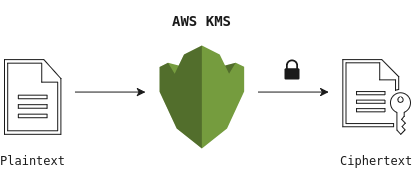
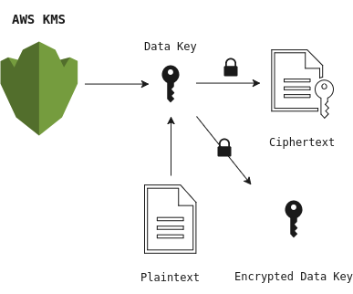

In this post, I am going to introduce a method using AWS KMS, envelope encryption and OpenSSL as an alternative for securing private data in your public GitHub/ Bitbucket repositories. You will learn how to use AWS KMS and how to implement your own encryption mechanism. Finally, I have created a repository with an example implementation written in shell ~ check out the [aws-kms-boilerplate repository on GitHub](https://github.com/matchilling/aws-kms-boilerplate) and have a look at the `encrypt` and `decrypt` shell scripts in the `bin/` directory.


[Bruno Pedro](http://twitter.com/bpedro) wrote a brief article recently on [dev.to](https://dev.to/bpedro/how-to-securely-store-api-keys-ab6) about storing application credentials securely alongside your code and provided a short list of different solutions including `git-crypt`, `git-secret`, `git-remote-gcrypt` and Stack Overflow's [BlackBox tool](https://github.com/StackExchange/blackbox).

While most of the tools are doing an excellent job I found, that one more or less obvious solution was missing in his enumeration. Because chances are high, that you are already running infrastructure/ code leveraging Amazon Web Services you may find a solution which doesn't add another new service to your stack attractive.

That alternative I am going to introduce briefly uses [Amazon's Key Management Service (KMS)](https://aws.amazon.com/kms/) and [OpenSSL](https://www.openssl.org).

## Amazon's key management service (KMS)

AWS KMS is a fully managed service that makes it easy to create and control encryption keys on AWS which can then be utilised to encrypt and decrypt data in a safe manner. The service leverages [Hardware Security Modules (HSM)](https://en.wikipedia.org/wiki/Hardware_security_module) under the hood which in return guarantees security and integrity of the generated keys.

Compliance and security monitoring are ensured in KMS by using key-based permission policies and integrating with Amazon's Identity and Access Management (IAM) which allows access management to a very granular level. KMS also offers hassle-free key-rotation and logs all events associated with a given key to AWS CloudTrail by default.

Let's go quickly through the **central concepts** KMS is based on before diving into the code example.

### KMS main concepts

KMS utilises [symmetric encryption](https://en.wikipedia.org/wiki/Symmetric-key_algorithm) which means that the same key is used for encryption and decryption. We differentiate between two type of keys:

- The **Customer Master Key (CMK)** is a logical key which represents the primary resource in AWS KMS. Master keys are either customer- or AWS managed and can be used to encrypt up to 4 kilobytes (4096 bytes) of raw data directly. CMKs are unique to your AWS account and the AWS region in which they are used.

- **Data Keys** are used to encrypt large data objects which exceed the 4KB-master-key limit. Be aware that Amazon Key Management in contrast to CMKs does not store any *Data Keys* and that the plain- and ciphertext of the generated key is being exposed.

### Basic vs. Envelope encryption

The following diagram illustrates AWS KMS' **basic encryption**.  The [encrypt command](http://docs.aws.amazon.com/cli/latest/reference/kms/encrypt.html) encrypts plaintext into ciphertext by using your *Customer Master Key* (CMK).

[](./aws_kms_basic_encryption.svg)

Using **basic encryption** is straightforward, but it comes with a couple of drawbacks. First, encrypting a significant amount of data is expensive as you have to transmit all your data over the wire in order to encrypt it on Amazon's server. Secondly, transferring data over a network could cause potential security breaches and lead to an unauthorised disclosure of, or access to your data. Third, the built-in 4KB limitation prevents you from encrypting large files like for example server certificates etc. Sure, you could chunk the data up and reassemble it later during decryption, but rather than doing that let us have a look how we can do better by applying envelope encryption.

**Envelope Encryption** is a practice of encrypting plaintext data with a unique *Data Key*, and then encrypting the *Data Key* with a key encryption key (KEK).

[](./aws_kms_envelope_encryption.svg)

The diagram above shows the data encryption process in which the KMS service produces a *Data Key* against our previously defined *Customer Master Key*, which is then used to encrypt our documents. The main difference compared to the previous method is that encryption is done locally in the client. Because we do not have to transmit the plaintext over the wire, we gain a significant performance boost while still keeping our sensitive data safely stored on our server.

## Getting started

In the following code example, I will demonstrate the core functions which are used in the [aws-kms-boilerplate repository](https://github.com/matchilling/aws-kms-boilerplate). I am going to assume that you have setup your AWS credentials correctly.

### 1. Create a customer master key (CMK)

The first step is to create a *Customer Master Key*. You can skip this step if you have already set up one which you want to use. You can retrieve a list of all your available master keys with the following AWS CLI command:

```bash
$ aws kms list-keys
```

```json
{
  "Keys": [{
    "KeyArn": "arn:aws:kms:region:************:key/********-****-****-****-************",
    "KeyId": "********-****-****-****-************"
  }]
}
```

If you don't have a *Customer Master Key* set up, or you want to use another one you can quickly create a new key with the following command:

```bash
$ aws kms create-key
```

```json
{
  "KeyMetadata": {
    "Origin": "AWS_KMS",
    "KeyId": "********-****-****-****-************",
    "Description": "",
    "Enabled": true,
    "KeyUsage": "ENCRYPT_DECRYPT",
    "KeyState": "Enabled",
    "CreationDate": 1513813027.113,
    "Arn": "arn:aws:kms:region:************:key/********-****-****-****-************",
    "AWSAccountId": "************"
  }
}
```

### 2. Create a key alias (optional)

Assigning an alias to your master key is a handy thing to do as it simplifies the key-usage especially when you are in your terminal and typing commands manually. Most of the AWS KMS commands accept an alias as the `--key-id` parameter, so you don't have to refer to the key by its long id.

```bash
$ aws kms create-alias \
  --alias-name 'alias/kms-tutorial' \
  --target-key-id '********-****-****-****-************'
```

### 3. Create a data key

With our new CMK will now generate a *Data Key* using the `generate-data-key` command which returns a data encryption key that we will later use to encrypt data locally. See that we have defined the `--key-spec` parameter to generate a 256-bit long symmetrical encryption key using the [AES algorithm](https://en.wikipedia.org/wiki/Advanced_Encryption_Standard).

```bash
$ aws kms generate-data-key \
  --key-id 'alias/kms-tutorial' \
  --key-spec 'AES_256' > './.key/data_key.json'
```

Note that the `Plaintext` and `CiphertextBlob` properties in the returned JSON are base64 encoded and that the `KeyId` does not refer the generated *Data Key* but to the *Customer Master Key*.

**It is important to understand that AWS KMS does not keep any records of your *Data Key* on their servers ~ so you have to manage those keys by yourself.**

```json
{
  "Plaintext": "4XY5FgHP1JyH7SkNYjY6C6gpZlWLbG0jkw06dVu0B4I=",
  "KeyId": "arn:aws:kms:region:************:key/********-****-****-****-************",
  "CiphertextBlob": "AQIDAHiP2nl/OYfqakZzv1qo7ir0iHai3O1Utd4q71Louy78XgGOk8YwfNOJo77u6nxAye/RAAAAfjB8BgkqhkiG9w0BBwagbzBtAgEAMGgGCSqGSIb3DQEHATAeBglghkgBZQMEAS4wEQQMWfzIpfhT/iCHuZBdAgEQgDvFMB7ItgfGhdDdKZj6dMpzdiyYLuGKXNK2WpCrl1wi0S8uCZdtKpllJMNlhLaRVeX0ghxMqD+JK8gSfQ=="
}
```
### 4. Storing the CipherTextBlob

Next, we are going to extract the `CipherTextBlob` from the `data_key.json` , base64 decode and store it in our repository. The OpenSSL toolkit provides a base64 implementation which we will use for the decoding.

**The blob contains meta-data about which CMK was used during data key creation. It will allow us to retrieve the plaintext key later on decryption.**

```bash
$ sed -nr 's/^.*"CiphertextBlob":\s*"(.*?)".*$/\1/p' './.key/data_key.json' \
  | openssl base64 -d > './.key/ciphertext_blob_decoded'
```

### 5. Encrypting the data

Before we can start to encrypt our example data, we need to extract, and base64 decode the plaintext key from the `data_key.json` as we did with the `CipherTextBlob` in the previous step.

```bash
$ sed -nr 's/^.*"Plaintext":\s*"(.*?)".*$/\1/p' './.key/data_key.json' \
  | openssl base64 -d > './.key/plaintext_key_decoded'
```

As we now have stored the decoded cypher- and plaintext key in our `.key/` directory we can get rid of the `data_key.json` file as it is no longer needed.

*Note that we are using the [`shred`](https://linux.die.net/man/1/shred) command rather than a simple `rm` to delete the key file securely.*

```bash
$ shred \
  --iterations=100 \
  --remove=wipesync \
  --zero './.key/data_key.json'
```

Finally, we can start encrypting our data using OpenSSL and AES. In the following example we encrypt `.decrypted/database.json` with the plaintext key and store the result in `.encrypted/database.json`.

```bash
$ openssl enc -e -aes256 \
  -kfile './.key/plaintext_key_decoded' \
  -in '.decrypted/database.json' \
  -out '.encrypted/database.json'
```

Next, we delete the plaintext key, but before doing so, we make sure that the base64 decoded `CipherTextBlob` has been stored correctly as the blob will be the only way to recover and decrypt our saved data.

```bash
$ shred \
  --iterations=100 \
  --remove=wipesync \
  --zero './.key/plaintext_key_decoded'
```

### 6. Decrypting the data

Decrypting data is the most straightforward part. As we have deleted the plaintext key after finishing our encryption, we need to restore it first by leveraging the `aws kms decrypt` command.

Because the `CipherTextBlob` contains meta-data, we do not need to tell KMS which CMK was used for the *Data Key* during creation-time.

Note that the original response from the decrypt command returns a JSON object with the *Customer Master Key Id*. The query parameter allows us to return only the property we are interested in, which is handy as JSON manipulation in the terminal without libraries such as `awk`, or `jq` is quite messy and error-prone.

Before using the plaintext key, we need to base64 decode the response as we have done before.

```bash
$ aws kms decrypt \
  --ciphertext-blob 'fileb://./.key/ciphertext_blob_decoded' \
  --query 'Plaintext' \
  --output text | openssl base64 -d -out './.key/plaintext_key_decoded'
```

Last, we pass the plaintext key to OpenSSL toolkit, and we get our encrypted example data decrypted.

```bash
$ openssl enc -d -aes256 \
  -kfile './.key/plaintext_key_decoded' \
  -in '.encrypted/database.json' \
  -out '.decrypted/database.json'
```

### 7. Log & audit CMK activity

AWS Key Management Service integrates with [CloudTrail](https://aws.amazon.com/cloudtrail/), which captures API calls made by or on behalf of AWS KMS in your AWS account and writes the logs to an Amazon S3 bucket that you specify.

With CloudTrail's help, you can determine what request was made, the source IP address from which the request was made, who made the request, when it was made, and so on.

## AWS KMS boilerplate

To make it easier for you to implement an encrypting mechanism for your project, I have created an accompanying [repository on GitHub](https://github.com/matchilling/aws-kms-boilerplate), which should help to demonstrate the basic usage of AWS KMS, OpenSSL and how to store sensitive data securely along with your code.

**Basic usage:**

- Setup your AWS account
- Create an AWS KMS *Customer Master Key* as described and assign an alias to it as described in step 1 and 2.
- Place your security sensitive data such as API keys, database credentials etc. in the `.decrypted/` folder.
- For encryption execute `./bin/encrypt --kms-id=alias/your-key`.
- For decryption execute `./bin/decrypt`.
- *Note: activate the debugging mode by passing `--debug=true` into the script*

For further details check the `encrypt` and `decrypt` shell scripts in the `bin/` directory. Both scripts contain a lot of comments which should make it trivial to follow the program.

## Final words

By now you should have got a good grasp of the central concepts behind AWS KMS, envelope encryption and you should also be able to implement an encryption mechanism for your project. I hope the examples provided in this post as well as in the accompanying repository on GitHub were of any help.

Keep in mind that security breaches do occur all the time! Furthermore, [most breaches](https://www.infoworld.com/article/3193028/security/annual-verizon-security-report-says-sloppiness-causes-most-data-breaches.html) are caused because somebody did something that he was not supposed to do, or somebody did not do something that he was supposed to do. Either way the attacker just has to be patient and sit and wait for such an event.

It is almost 2018, and I still see plenty of enterprise projects where database credentials are stored in plaintext under version control :see_no_evil:.

As an IT professional you must take security seriously! Securing your data with proper methods like aforementioned or described in [Bruno's post](https://dev.to/bpedro/how-to-securely-store-api-keys-ab6) could be the decisive factor which saves the day if the worst case occurs.

**There is absolutely no excuse for not encrypting security-sensitive data!**

## References

* [AWS KMS Boilerplate](https://github.com/matchilling/aws-kms-boilerplate)
* [AWS Key Management Service Developer Guide](https://docs.aws.amazon.com/kms/latest/developerguide/overview.html)
* [OpenSSL Documentation](https://www.openssl.org/docs/)

*Found an issue? Please drop me a line via email/ twitter or open a [pull request on GitHub](https://github.com/matchilling/aws-kms-boilerplate/pulls)!*
